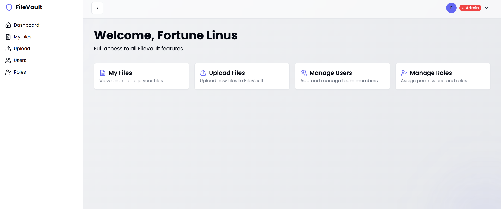
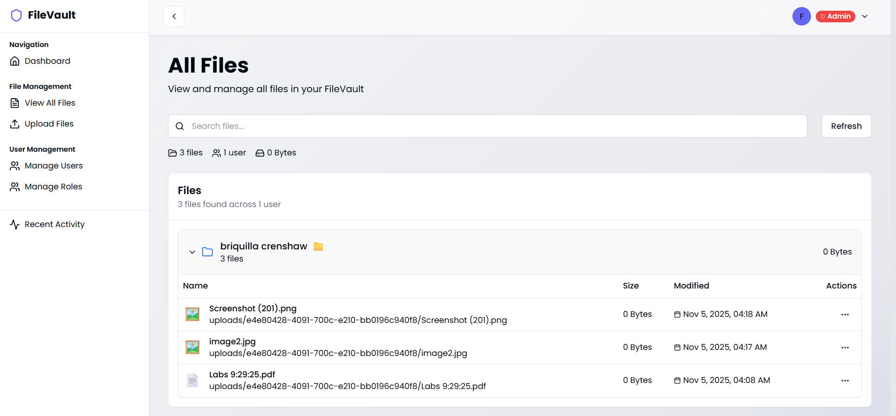

# FileVault - Secure File Management System

A modern, secure file management application built with React, TypeScript, AWS Cognito, and Terraform for infrastructure as code.

<!-- Add architecture diagram here -->


<!-- Add screenshots here -->



---

## 🚀 Features

### Frontend
- **🔐 Secure Authentication**: User registration, login, and email verification via AWS Cognito
- **👥 Role-Based Access Control**: Admin, Editor, and Viewer roles with granular permissions
- **📁 File Management**: Upload, download, list, and delete files with S3 integration
- **🎨 Modern UI**: Built with shadcn/ui components and Tailwind CSS
- **📱 Responsive Design**: Fully responsive layout optimized for all devices
- **⚡ Real-time Upload Progress**: Visual feedback during file uploads
- **🛠️ User Management**: Admin tools to manage users, roles, and permissions

### Backend & Infrastructure
- **☁️ Serverless Architecture**: AWS Lambda functions for scalable API endpoints
- **🔒 Secure Storage**: S3 buckets with KMS encryption at rest
- **🌐 API Gateway**: RESTful API with Cognito authorization
- **🏗️ Infrastructure as Code**: Complete Terraform configuration
- **📊 Audit Logging**: CloudTrail and DynamoDB audit tables
- **🔄 Lifecycle Management**: Automated file archival and deletion policies

---

## 🏗️ Architecture

```
┌─────────────────┐
│   React SPA     │  (Frontend - Port 8080)
│  Vite + TS      │
└────────┬────────┘
         │
         ▼
┌─────────────────────────────────────┐
│      AWS API Gateway                │  (REST API)
│  Cognito Authorization              │
└────────┬────────────────────────────┘
         │
    ┌────┴────┬──────────┬─────────┐
    ▼         ▼          ▼         ▼
┌─────────┐ ┌──────┐ ┌──────┐ ┌──────┐
│ Lambda  │ │Lambda│ │Lambda│ │Lambda│  (Python 3.12)
│ Upload  │ │ List │ │Delete│ │Users │
└────┬────┘ └───┬──┘ └───┬──┘ └───┬──┘
     │          │        │        │
     └──────────┴────────┴────────┘
                  │
         ┌────────┴────────┐
         ▼                 ▼
    ┌─────────┐      ┌──────────┐
    │  S3     │      │ DynamoDB │  (Metadata + Audit)
    │ Buckets │      │  Tables  │
    └─────────┘      └──────────┘
```

<!-- Add detailed architecture diagram here -->


---

## 📋 Prerequisites

- **Node.js**: version 18 or higher
- **npm** or **yarn**: Package manager
- **AWS Account**: With appropriate permissions
- **Terraform**: version >= 1.5.0
- **AWS CLI**: Configured with credentials
- **Git**: For version control

---

## 🛠️ Technologies

### Frontend
| Technology | Purpose |
|------------|---------|
| **Vite** | Fast build tool and development server |
| **TypeScript** | Type-safe JavaScript |
| **React 18** | UI library with hooks |
| **shadcn/ui** | Modern UI component library |
| **Tailwind CSS** | Utility-first CSS framework |
| **AWS Amplify** | Authentication and cloud services |
| **React Router** | Client-side routing |
| **React Hook Form** | Form management |
| **Zod** | Schema validation |
| **Axios** | HTTP client |

### Backend & Infrastructure
| Technology | Purpose |
|------------|---------|
| **AWS Lambda** | Serverless functions (Python 3.12) |
| **API Gateway** | REST API endpoints |
| **AWS Cognito** | Authentication and authorization |
| **S3** | Object storage with encryption |
| **DynamoDB** | NoSQL database for metadata |
| **KMS** | Key management for encryption |
| **CloudTrail** | Audit logging |
| **Terraform** | Infrastructure as code |
| **VPC** | Network isolation |

---

## 🚦 Getting Started

### 1. Clone the Repository

```bash
git clone <YOUR_GIT_URL>
cd filevault
```

### 2. Deploy Infrastructure

**Initial Setup (One-time):**
```bash
cd infrastructure/scripts
./setup-backend.sh  # Creates S3 state bucket and DynamoDB lock table
```

**Deploy Infrastructure:**
```bash
cd infrastructure/terraform

# Initialize Terraform
terraform init

# Plan the deployment
terraform plan

# Apply changes
terraform apply

# Note the outputs (API endpoint, Cognito IDs, etc.)
terraform output
```

**Build Lambda Functions:**
```bash
# On Windows
cd infrastructure/scripts
.\zip-lambdas.ps1

# On Linux/Mac
cd infrastructure/scripts
./zip-lambdas.sh

# Then return to terraform directory
cd ../terraform
terraform apply
```

### 3. Configure Frontend

**Install Dependencies:**
```bash
cd frontend
npm install
```

**Create Environment File:**
```bash
# Create .env file in frontend directory
touch .env  # or copy from example if available
```

**Configure `.env`:**
```env
# AWS Configuration
VITE_REGION=us-east-1

# Cognito Configuration
VITE_USER_POOL_ID=<from terraform output>
VITE_USER_POOL_CLIENT_ID=<from terraform output>

# API Configuration
VITE_API_ENDPOINT=<from terraform output>
```

**Get Configuration Values:**
```bash
# From infrastructure/terraform directory
terraform output user_pool_id
terraform output user_pool_client_id
terraform output api_endpoint
```

### 4. Run Development Server

```bash
cd frontend
npm run dev
```

The application will be available at `http://localhost:8080`

---

## 📁 Project Structure

```
filevault/
├── frontend/                          # React frontend application
│   ├── src/
│   │   ├── components/                # Reusable UI components
│   │   │   ├── ui/                   # shadcn/ui components
│   │   │   │   ├── button.tsx
│   │   │   │   ├── card.tsx
│   │   │   │   ├── sidebar.tsx
│   │   │   │   └── ...
│   │   │   ├── ProtectedRoute.tsx
│   │   │   ├── InactivityWarning.tsx
│   │   │   └── UploadDebug.tsx
│   │   ├── config/                   # Configuration files
│   │   │   └── aws-config.ts
│   │   ├── contexts/                 # React contexts
│   │   │   └── AuthContext.tsx
│   │   ├── hooks/                    # Custom React hooks
│   │   ├── lib/                      # Utility functions
│   │   ├── pages/                    # Page components
│   │   │   ├── Dashboard.tsx
│   │   │   ├── Login.tsx
│   │   │   ├── Register.tsx
│   │   │   ├── Files.tsx
│   │   │   ├── Upload.tsx
│   │   │   ├── Users.tsx
│   │   │   ├── ManageRoles.tsx
│   │   │   └── ...
│   │   ├── services/                 # API service layers
│   │   │   ├── fileService.ts
│   │   │   └── userService.ts
│   │   ├── index.css                 # Global styles
│   │   └── main.tsx                  # Application entry point
│   ├── index.html
│   ├── package.json
│   ├── vite.config.ts
│   ├── tailwind.config.ts
│   └── .gitignore
│
├── infrastructure/                    # Infrastructure as Code
│   ├── terraform/                    # Terraform configuration
│   │   ├── main.tf                  # Root configuration
│   │   ├── variables.tf             # Variable definitions
│   │   ├── outputs.tf               # Output values
│   │   ├── providers.tf             # Provider configuration
│   │   └── modules/                 # Reusable modules
│   │       ├── api/                 # API Gateway module
│   │       ├── auth/                # Cognito module
│   │       ├── lambdas/             # Lambda functions
│   │       │   ├── upload/
│   │       │   ├── list/
│   │       │   ├── download/
│   │       │   ├── delete/
│   │       │   ├── users/
│   │       │   └── ...
│   │       ├── networking/          # VPC module
│   │       ├── security/            # Security & IAM
│   │       └── storage/             # S3 & DynamoDB
│   └── scripts/                     # Deployment scripts
│       ├── zip-lambdas.ps1          # Build Lambda packages
│       ├── zip-lambdas.sh           # Build Lambda packages (Linux/Mac)
│       ├── setup-backend.sh         # Setup Terraform backend
│       ├── destroy-infrastructure.ps1 # Cleanup script
│       └── test-*.sh                # Test scripts
│
├── docs/                             # Documentation
│   ├── images/                      # Screenshots and diagrams
│   │   ├── architecture.png
│   │   ├── architecture-detailed.png
│   │   ├── dashboard.png
│   │   └── files.png
│   ├── week1.md
│   ├── week2.md
│   └── week3.md
│
├── .gitignore                        # Git ignore rules
└── README.md                         # This file
```

---

## 🔐 Environment Variables

### Frontend Environment Variables

Create a `.env` file in the `frontend` directory:

```env
# AWS Configuration
VITE_REGION=us-east-1

# Cognito Configuration
VITE_USER_POOL_ID=us-east-1_XXXXXXXXX
VITE_USER_POOL_CLIENT_ID=XXXXXXXXX

# API Configuration
VITE_API_ENDPOINT=https://XXXXXXXX.execute-api.us-east-1.amazonaws.com/dev
```

### Terraform Variables

Set in `infrastructure/terraform/terraform.tfvars` or pass via CLI:

```hcl
aws_region          = "us-east-1"
env                 = "dev"
project_name        = "filevault"
vpc_cidr            = "10.0.0.0/16"
public_subnet_cidr  = "10.0.1.0/24"
private_subnet_cidr = "10.0.2.0/24"
```

---

## 🧪 Testing

### Test Infrastructure
```bash
cd infrastructure/scripts

# Test authentication
./test-auth.sh

# Test API endpoints
./test-api.sh

# Test file operations
./test-files.sh
./test-upload.sh

# Test specific roles
./test-api-admin.sh
./test-api-editor.sh
./test-api-viewer.sh
```

### Test Frontend
```bash
cd frontend

# Run linter
npm run lint

# Build for production
npm run build

# Preview production build
npm run preview
```

---

## 🚀 Deployment

### Frontend Deployment Options

#### Option 1: AWS Amplify (Recommended)

1. Connect your GitHub repository to AWS Amplify
2. Configure build settings:
   - **Build command**: `npm run build`
   - **Output directory**: `dist`
   - **Base directory**: `frontend`
3. Add environment variables from your Terraform outputs
4. Deploy automatically on push to main branch

#### Option 2: Static Hosting (S3 + CloudFront)

**Build Frontend:**
```bash
cd frontend
npm run build
```

**Deploy to S3:**
```bash
aws s3 sync dist/ s3://your-bucket-name --delete
```

**Configure CloudFront** (via AWS Console or Terraform module)

#### Option 3: Other Platforms

- **Vercel**: `vercel --prod`
- **Netlify**: Connect repository for automatic deployments

---

## 🗑️ Cleanup

**Destroy All Infrastructure:**
```bash
cd infrastructure/scripts

# On Windows
.\destroy-infrastructure.ps1

# On Linux/Mac
cd ../terraform
terraform destroy -auto-approve
```

This will:
1. Empty S3 buckets
2. Delete all AWS resources
3. Remove Terraform state

**Note:** You may need to manually delete the Terraform state bucket and lock table.

---

## 📊 Monitoring & Logs

- **CloudWatch Logs**: Lambda function logs with execution details
- **CloudTrail**: API and resource access logs for audit trails
- **DynamoDB Audit Tables**: User and file operation audits
- **S3 Access Logging**: Bucket access logs for security monitoring

---

## 🔒 Security Features

- **🔐 KMS Encryption**: All S3 objects encrypted at rest with customer-managed keys
- **🔒 TLS Only**: HTTPS enforced for all communications
- **🛡️ IAM Roles**: Least-privilege access for Lambda functions
- **🔑 Cognito**: Secure authentication and authorization flows
- **🌐 VPC Isolation**: Network-level security boundaries
- **📋 Audit Logging**: Comprehensive audit trails for compliance
- **⏰ Lifecycle Policies**: Automated data retention and archival

---

## 👥 User Roles & Permissions

| Role   | Upload | Download | Delete | Manage Users | Manage Roles |
|--------|--------|----------|--------|--------------|--------------|
| **Admin**  | ✅     | ✅       | ✅     | ✅           | ✅           |
| **Editor** | ✅     | ✅       | ❌     | ❌           | ❌           |
| **Viewer** | ✅     | ✅       | ❌     | ❌           | ❌           |

### Role Descriptions

- **Admin**: Full system access including user management and role assignment
- **Editor**: Can upload and download files but cannot delete or manage users
- **Viewer**: Read-only access with ability to download existing files

---

## 📝 Available Scripts

### Frontend Scripts
```bash
cd frontend

npm run dev          # Start development server
npm run build        # Build for production
npm run build:dev    # Build for development
npm run preview      # Preview production build
npm run lint         # Run ESLint
```

### Infrastructure Scripts
```bash
cd infrastructure/terraform

terraform init       # Initialize Terraform
terraform plan       # Preview changes
terraform apply      # Apply changes
terraform destroy    # Destroy infrastructure
terraform output     # Show output values
```

### Utility Scripts
```bash
cd infrastructure/scripts

# Build Lambda packages
.\zip-lambdas.ps1        # Windows
./zip-lambdas.sh         # Linux/Mac

# Setup backend
./setup-backend.sh

# Destroy infrastructure
.\destroy-infrastructure.ps1   # Windows
terraform destroy -auto-approve # Linux/Mac
```

---

## 🤝 Contributing

1. Fork the repository
2. Create a feature branch (`git checkout -b feature/amazing-feature`)
3. Commit your changes (`git commit -m 'Add amazing feature'`)
4. Push to the branch (`git push origin feature/amazing-feature`)
5. Open a Pull Request

---

## 📄 License

This project is licensed under the MIT License.

---

## 🙋 Support

For issues, questions, or contributions, please open an issue on GitHub.

---

## 🔄 Changelog

### Version 1.0.0 (Current)

#### Frontend Features
- ✅ Complete React frontend with responsive design
- ✅ AWS Cognito authentication and authorization
- ✅ Role-based access control (Admin, Editor, Viewer)
- ✅ File upload/download with progress tracking
- ✅ Modern UI with shadcn/ui components
- ✅ S3 integration with KMS encryption
- ✅ User management interface for admins

#### Backend Features
- ✅ Serverless Lambda functions (Python 3.12)
- ✅ RESTful API with AWS API Gateway
- ✅ DynamoDB for metadata storage
- ✅ Complete Terraform infrastructure as code
- ✅ CloudTrail audit logging
- ✅ Lifecycle policies for data retention

#### Security Features
- ✅ KMS encryption at rest
- ✅ TLS encryption in transit
- ✅ IAM least-privilege access
- ✅ VPC network isolation
- ✅ Comprehensive audit trails

---

**Built with ❤️ using React, AWS, and Terraform**

<!-- Add badges here if desired -->
[](https://opensource.org/licenses/MIT)
[](https://aws.amazon.com/)
[](https://www.terraform.io/)
[](https://reactjs.org/)
