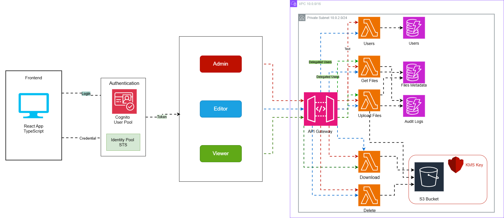

# FileVault - Secure Cloud File Storage Documentation

Welcome to the FileVault documentation! This project is a comprehensive learning journey into building a secure, cloud-based file storage system using modern AWS services and best practices.

## 🎯 Project Overview

FileVault is a secure file management system designed to teach and demonstrate:
- **Infrastructure as Code** with Terraform
- **Serverless architecture** using AWS Lambda and API Gateway
- **Secure authentication** with AWS Cognito
- **Encrypted storage** with S3 and KMS
- **Role-based access control** (RBAC)
- **Modern frontend** development with React and TypeScript

## 🏗️ Architecture




## 📚 Documentation Structure

This documentation is organized into phases that represent the development journey:

### [Phase 1: Infrastructure Foundation](./docs/phase1-infrastructure.md)
- VPC and networking setup
- S3 storage with KMS encryption
- IAM roles and policies
- Terraform state management
- CloudTrail audit logging

### [Phase 2: Authentication & Authorization](./docs/phase2-authentication.md)
- AWS Cognito User Pool configuration
- User registration and password policies
- Role-based access control (Admin, Editor, Viewer)
- Cognito Identity Pool and STS credentials
- Authentication flows and token management

### [Phase 3: Backend API Development](./docs/phase3-backend-api.md)
- API Gateway HTTP API setup
- Lambda functions for file operations
- Cognito JWT authorization
- Presigned URL generation
- Error handling and security

### [Phase 4: Frontend Application](./docs/phase4-frontend.md)
- React application architecture
- Authentication UI and flows
- File management interface
- Role-based UI components
- AWS SDK integration

### [Phase 5: Advanced Features](./docs/phase5-advanced-features.md)
- Multi-Factor Authentication (MFA)
- User management operations
- Role management and delegation
- Delegated access (Editor → Viewer)
- Admin operations

### [Security Best Practices](./docs/security-best-practices.md)
- Encryption at rest and in transit
- Least privilege IAM policies
- Defense in depth strategies
- Compliance considerations
- Security monitoring

### [Deployment & Operations](./docs/deployment.md)
- Deployment procedures
- Testing strategies
- Monitoring and logging
- Troubleshooting guide
- Cleanup procedures

## 🚀 Quick Start

1. **Deploy Infrastructure**
   ```bash
   cd infrastructure/terraform
   terraform init
   terraform plan
   terraform apply
   ```

2. **Configure Frontend**
   ```bash
   cd frontend
   npm install
   # Create .env file with Terraform outputs
   npm run dev
   ```

3. **Access Application**
   - Frontend: `http://localhost:8080`
   - API: Check Terraform outputs for endpoint

## 🎓 Learning Objectives

By completing this project, you will learn:

1. **Infrastructure as Code**
   - Terraform module design
   - State management
   - Resource dependencies

2. **AWS Services**
   - Cognito for authentication
   - Lambda for serverless compute
   - S3 for object storage
   - KMS for encryption
   - API Gateway for REST APIs
   - DynamoDB for metadata

3. **Security**
   - Encryption at rest and in transit
   - IAM least privilege
   - JWT token validation
   - Audit logging

4. **Modern Development**
   - React with TypeScript
   - Serverless architecture
   - RESTful API design
   - Error handling

## 📋 Prerequisites

- AWS Account with appropriate permissions
- Terraform >= 1.5.0
- Node.js >= 18
- AWS CLI configured
- Git for version control

## 🔗 Related Resources

- [AWS Documentation](https://docs.aws.amazon.com/)
- [Terraform AWS Provider](https://registry.terraform.io/providers/hashicorp/aws/latest/docs)
- [React Documentation](https://react.dev/)
- [AWS Cognito Guide](https://docs.aws.amazon.com/cognito/)

## 📝 Project Status

✅ **Completed Features:**
- Infrastructure foundation
- Authentication and authorization
- Backend API with Lambda functions
- Frontend React application
- MFA support
- User and role management
- Delegated access

🔄 **Future Enhancements:**
- File versioning UI
- Advanced search and filtering
- File sharing links
- Mobile application
- Multi-region deployment

---

**Built for learning secure cloud security and development**

